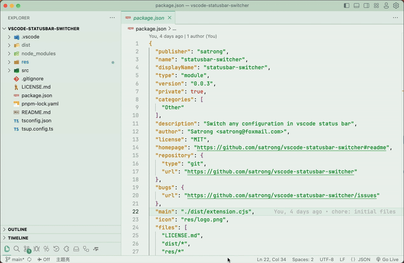

# vscode-statusbar-switcher

Switch any configuration in vscode status bar

## Example

## Commands
<!-- commands -->

**No data**

<!-- commands -->

## Configs
<!-- configs -->

| Key                         | Description | Type    | Default |
| --------------------------- | ----------- | ------- | ------- |
| `statusbar-switcher.config` | 配置切换列表      | `array` | `[]`    |

<!-- configs -->